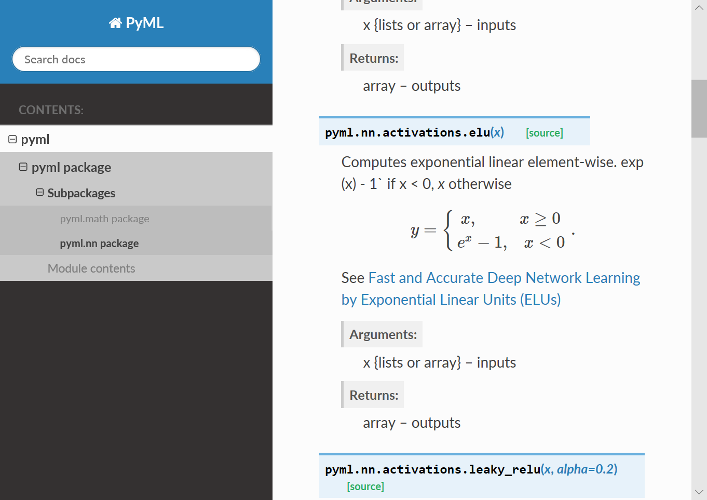

.. _ChapterMakeManualAPI:

API手册制作指南
================

通过该部分教程学习，你学会从代码注释API生成函数手册！

一个例子
----------------

撰写代码和文档
~~~~~~~~~~~~~~~~

以本人写的一个 Python 工具代码为例, 在 `这里 <https://github.com/antsfamily/pytool>`_ 下载源码.

初始化Sphinx工程
~~~~~~~~~~~~~~~~~

0. 在源码根目录, 新建 `docs` 文件夹, 进入该文件夹
1. 终端输入: ``sphinx-quickstart`` 启动Sphinx
2. 设置项目名称为 `PyTool` , 作者名, 工程发布版本(Project release)等
3. 设置项目文档语言等, 类似如下

::

   PS D:\ws\github\pytool\docs> sphinx-quickstart.exe
   Welcome to the Sphinx 1.8.1 quickstart utility.

   Please enter values for the following settings (just press Enter to
   accept a default value, if one is given in brackets).

   Selected root path: .

   You have two options for placing the build directory for Sphinx output.
   Either, you use a directory "_build" within the root path, or you separate
   "source" and "build" directories within the root path.
   > Separate source and build directories (y/n) [n]: y

   Inside the root directory, two more directories will be created; "_templates"
   for custom HTML templates and "_static" for custom stylesheets and other static
   files. You can enter another prefix (such as ".") to replace the underscore.
   > Name prefix for templates and static dir [_]:

   The project name will occur in several places in the built documentation.
   > Project name: PyTool
   > Author name(s): Zhi Liu
   > Project release []: 1.0

   If the documents are to be written in a language other than English,
   you can select a language here by its language code. Sphinx will then
   translate text that it generates into that language.

   For a list of supported codes, see
   http://sphinx-doc.org/config.html#confval-language.
   > Project language [en]:

   The file name suffix for source files. Commonly, this is either ".txt"
   or ".rst".  Only files with this suffix are considered documents.
   > Source file suffix [.rst]:

   One document is special in that it is considered the top node of the
   "contents tree", that is, it is the root of the hierarchical structure
   of the documents. Normally, this is "index", but if your "index"
   document is a custom template, you can also set this to another filename.
   > Name of your master document (without suffix) [index]:
   Indicate which of the following Sphinx extensions should be enabled:
   > autodoc: automatically insert docstrings from modules (y/n) [n]: y
   > doctest: automatically test code snippets in doctest blocks (y/n) [n]: y
   > intersphinx: link between Sphinx documentation of different projects (y/n) [n]: y
   > todo: write "todo" entries that can be shown or hidden on build (y/n) [n]: y
   > coverage: checks for documentation coverage (y/n) [n]: y
   > imgmath: include math, rendered as PNG or SVG images (y/n) [n]: y
   > mathjax: include math, rendered in the browser by MathJax (y/n) [n]: y
   > ifconfig: conditional inclusion of content based on config values (y/n) [n]: y
   > viewcode: include links to the source code of documented Python objects (y/n) [n]: n
   > githubpages: create .nojekyll file to publish the document on GitHub pages (y/n) [n]: y
   Note: imgmath and mathjax cannot be enabled at the same time. imgmath has been deselected.

   A Makefile and a Windows command file can be generated for you so that you
   only have to run e.g. `make html' instead of invoking sphinx-build
   directly.
   > Create Makefile? (y/n) [y]: y
   > Create Windows command file? (y/n) [y]: y

   Creating file .\source\conf.py.
   Creating file .\source\index.rst.
   Creating file .\Makefile.
   Creating file .\make.bat.

   Finished: An initial directory structure has been created.

   You should now populate your master file .\source\index.rst and create other documentation
   source files. Use the Makefile to build the docs, like so:
      make builder
   where "builder" is one of the supported builders, e.g. html, latex or linkcheck.

配置Sphinx工程
~~~~~~~~~~~~~~

1. 添加库路径. 

打开 `source/conf.py` 文件, 可以看到:

   # If extensions (or modules to document with autodoc) are in another directory,
   # add these directories to sys.path here. If the directory is relative to the
   # documentation root, use os.path.abspath to make it absolute, like shown here.
   #sys.path.insert(0, os.path.abspath('.'))

因而在 `conf.py` 中添加 ``sys.path.insert(0, os.path.abspath('../../'))``

.. hint::
   如果你生成的html文档中没有注释, 只有包名, 那么很有可能是没找到包, 可参见问题解决部分.

生成API注释文档
~~~~~~~~~~~~~~~~~

本部分使用 ``sphinx-apidoc`` 命令自动从代码中提取注释并生成 `rst` 文件.

回退到源码工程目录, 终端执行命令: ``sphinx-apidoc -o ./docs/source/ ./`` 将在 `source` 文件夹创建各模块的注释文档(``.rst``格式).

编译生成API手册
~~~~~~~~~~~~~~~~

接着打开 `index.rst` 文件, 在其中添加 `module.rst` 文件, 如下:

::

   Welcome to PyTool's documentation!
   ==================================

   .. toctree::
      :maxdepth: 2
      :caption: Contents:

      modules

   Indices and tables
   ==================

   * :ref:`genindex`
   * :ref:`modindex`
   * :ref:`search`

可以随意打开一个模块的 `rst` 文件, 如下:

::

   pytool.file package
   ===================

   Submodules
   ----------

   pytool.file.binfile module
   --------------------------

   .. automodule:: pytool.file.binfile
       :members:
       :undoc-members:
       :show-inheritance:

   pytool.file.copy module
   -----------------------

   .. automodule:: pytool.file.copy
       :members:
       :undoc-members:
       :show-inheritance:

可以看到文件中并没有注释, 那么怎么生成文档呢? 原来是在 ``build`` 时, Sphinx才提取文档注释, 生成文档.

.. hint::
   生成的模块的 `rst` 文件中的 ``.. automodule::`` 用于自动抽取文档注释.

然后像构建普通文档一样编译即可. 当然你还可以修改 `conf.py` 文件, 以修改文档主题等等.

生成的文档示例如下图所示:

   自动生成的文档示例

   使用Sphinx自动从PyML包中的注释, 提取并生成文档, 注释可以使用reStructedText语言撰写.

文档注释风格支持
-------------------

有两种:

- google风格
- numpy风格

如果代码中包含两种风格的注释, 可以在 `conf.py` 中的 `extensions` 处添加扩展 ``sphinx.ext.napoleon`` 即可.

问题解决
------------------

生成的文档无注释
~~~~~~~~~~~~~~~

如果你生成的html文档中没有注释, 只有包名, 那么很有可能是没找到包, 或者 **代码中用到的库没有装**. 在 `conf.py` 中添加 ``sys.path.insert(0, os.path.abspath('../../'))`` 设置好路径, 并安装缺失的相应模块即可.

.. figure:: ../_static/figs/APIdocs/nomodule.png
   :scale: 50 %
   :alt: no module error
   :align: center

   no module error

   no module error reported by Sphinx

注释中不显示公式
~~~~~~~~~~~~~~~~

在注释起始符前加 ``r`` , 如:

::

   r"""Computes tanh of `x` element-wise.

    Specifically, :math:`y = {\rm tanh}(x) = {{e^{2x} - 1} \over {e^{2x} + 1}}`.

    Arguments:
        x {lists or array} -- inputs

    Returns:
        array -- outputs

    """

